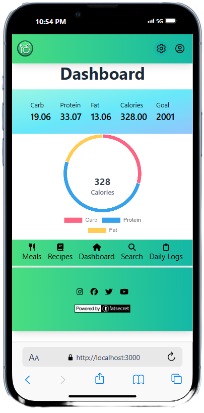

# 🥗 NutriPal

**Your #1 Nutrition Companion — a full-featured nutrition tracker with food logging, recipe creation, and barcode scanning powered by the FatSecret API.**


## 📸 Preview




## 🚀 Features

- ✅ **JWT Authentication** (with Refresh Token)
- 🍽️ **Search Foods** by name or barcode (FatSecret API)
- 📅 **Daily Food Logs** with nutrition breakdown
- 📊 **Dashboard** with calorie/macro charts
- 🧮 **Custom Recipes** builder and logger
- 🔍 **Barcode Scanner** using `Quagga2`
- 🌮 **One-click logging** from saved meals or recipes
- 📅 **Calendar-based log navigation**
- ⚙️ Profile management with calorie goals and image uploads


## 🧰 Tech Stack

| Frontend               | Backend              | Tools / APIs               |
|------------------------|----------------------|----------------------------|
| React + Tailwind CSS   | Node.js + Express    | FatSecret API              |
| Apollo Client (GraphQL)| Apollo Server        | JWT + Refresh Token Auth   |
| Luxon (Date Handling)  | MongoDB (Mongoose)   | Chart.js + React-Toastify  |
| React Router           | GraphQL + Ky.js      | Quagga2 (Barcode Scanner)  |

## :trophy: Badges

  

## 🧑‍💻 Getting Started

### 1️⃣ Clone the Repository

```bash
git clone https://github.com/your-username/nutryial.git
cd nutripal
```

### 2️⃣ Install Dependencies
`npm install`

### 3️⃣ Create `.env` File
`REACT_APP_API_URL=http://localhost:3001`
`REACT_APP_CLIENT_ID=your-fatsecret-client-id`
`REACT_APP_CLIENT_SECRET=your-fatsecret-client-secret`

Note: Ensure your FatSecret API credentials are valid and whitelisted by IP.

### ▶️ Running the App
Make sure the backend is running on http://localhost:3001, then run the frontend:
`npm start`

### 📁 Project Structure
```bash
client/
├── components/        # Reusable UI components (Dropdown, DonutChart, Calendar)
├── pages/             # Pages like Dashboard, Profile, Recipe, Search
├── utils/             # Auth, API wrappers, Apollo setup
├── hooks/             # Custom hooks like useAuth()
├── App.jsx
└── index.js

server/
├── config/            # Connection to the MongoDB
├── controllers/       # API routes
├── models/            # MongoDB schema definitions
├── schemas            # GraphQL schema definition
├── utils/             # Auth, Barcode converter, Nutrition calculator
├── server.js          # Express setup
└── package.json

```

### 🔐 Authentication Flow
Auth tokens are stored in l`ocalStorage`

Token expiration is checked with every route

If expired, the app tries to refresh via `/api/refresh`

Logout clears tokens and redirects to home

### 📦 API Endpoints (Express Server)
`POST /user/login`

`POST /user/signup`

`POST /api/refresh`

`GET /api/foodByName`

`GET /api/foodByBarcode`

`GET /api/foodByDate/:userId/date/:date`

`POST /api/one-food (logs food)`

`POST /api/daily-log (adds food to DailyLog)`

...and more

### 🧪 Future Improvements
Meal logging from saved meals (WIP)

Nutrition goal tracking + alerts

Improved mobile UX & offline support

Recipe editing & deletion

Weekly log view + charts

### ❤️ Credits
Data powered by FatSecret Platform API

Barcode scanning via @ericblade/quagga2

Icons via FontAwesome + Heroicons

### 📬 Contact
Built with passion by [Attila Bordan](https://bordanattila.github.io/Portfolio/)  
Say hi on [LinkedIn](https://www.linkedin.com/in/bordanattila/) 👋

### 📜 License
MIT © 2025 NutriPal