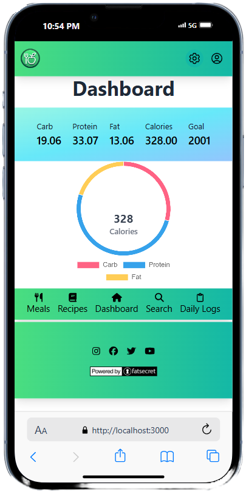
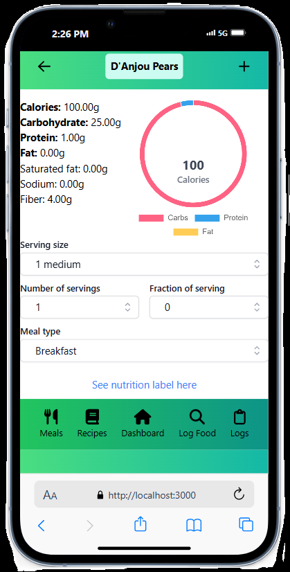

# 🥗 NutriPal

**Your #1 Nutrition Companion — a full-featured nutrition tracker with food logging, recipe creation, and barcode scanning powered by the FatSecret API.**


## 📸 Preview





## 🚀 Features

### Core Features
- ✅ **JWT Authentication** (with Refresh Token) - Secure authentication for both web and mobile
- 🍽️ **Search Foods** by name or barcode (FatSecret API)
- 📅 **Daily Food Logs** with detailed nutrition breakdown
- 📊 **Dashboard** with interactive calorie/macro charts
- 🧮 **Custom Recipes** builder and logger
- 🔍 **Barcode Scanner** - Web: Quagga2, Mobile: Native camera integration
- 🤖 **AI-Powered Suggestions** - Ask NutriPal AI what to eat to hit your macros (powered by LangChain.js + OpenAI)  
- 🌮 **One-click logging** from saved meals or recipes
- 📅 **Calendar-based log navigation** - Browse your food history by date
- ⚙️ **Profile Management** - Set calorie goals, macro targets, and upload profile pictures

### Platform Support
- 🌐 **Web Application** - Full-featured React web app
- 📱 **Mobile Application** - Native iOS/Android app built with React Native (Expo)
- 🔄 **Shared Backend** - Single API server supports both platforms
- 🔐 **Secure Storage** - Web uses localStorage, Mobile uses encrypted SecureStore


## 🧰 Tech Stack

| Frontend (Web)             | Frontend (Mobile)      | Backend                | Tools / APIs                       |
|----------------------------|------------------------|------------------------|------------------------------------|
| React + Tailwind CSS       | React Native (Expo)    | Node.js + Express      | FatSecret API                      |
| Apollo Client (GraphQL)    | Expo Router            | Apollo Server          | JWT + Refresh Token Auth           |
| Luxon (Date Handling)      | TypeScript             | MongoDB (Mongoose)     | Chart.js + React-Toastify          |
| React Router               | SecureStore            | GraphQL + REST         | Quagga2 (Barcode Scanner)          |
| **LangChain.js** (AI)      | Shared Packages        | Docker Support         | NutriPal AI endpoint (OpenAI API)  |

**Architecture**: Monorepo with pnpm workspaces, Turbo for build orchestration, shared code between web and mobile

## 🎯 AI Assist

NutriPal includes an **AI-Assist** feature built with [LangChain.js](https://js.langchain.com/) and OpenAI API.  
- 💬 Ask questions like "What should I eat for dinner?" along with your remaining macros  
- 🤖 AI responds with personalized meal suggestions based on your goals  
- 📊 Context-aware recommendations built on top of your daily log and macro targets
- 🎯 Helps you make informed decisions to hit your nutrition goals 

## :trophy: Badges

  

## 🧑‍💻 Getting Started

### Prerequisites
- Node.js 20.x
- pnpm 10.11.0 (or compatible version)
- MongoDB (local or cloud instance)
- FatSecret API credentials
- OpenAI API key (for AI Assist feature)

### 1️⃣ Clone the Repository

```bash
git clone https://github.com/your-username/nutripal.git
cd nutripal
```

### 2️⃣ Install Dependencies

This project uses **pnpm** as the package manager. Install it globally if you haven't already:

```bash
npm install -g pnpm@10.11.0
```

Then install all dependencies:

```bash
pnpm install
```

### 3️⃣ Create `.env` File

Create a `.env` file in the root directory with the following variables:

```env
# Server Configuration
PORT=4000
HOST=0.0.0.0
NODE_ENV=development

# Database
MONGODB_URI=your-mongodb-uri

# Authentication Secrets
SECRET_KEY=your-session-secret-key
TOKEN_SECRET=your-jwt-token-secret

# API URLs
REACT_APP_API_URL=http://localhost:4000
EXPO_PUBLIC_API_URL=http://localhost:4000

# FatSecret API Credentials
REACT_APP_CLIENT_ID=your-fatsecret-client-id
REACT_APP_CLIENT_SECRET=your-fatsecret-client-secret
EXPO_PUBLIC_CLIENT_ID=your-fatsecret-client-id
EXPO_PUBLIC_CLIENT_SECRET=your-fatsecret-client-secret

# OpenAI API (for AI Assist feature)
OPENAI_API_KEY_NP=your-openai-api-key
```

**Note**: 
- Ensure your FatSecret API credentials are valid and whitelisted by IP
- `SECRET_KEY` is used for session management
- `TOKEN_SECRET` is used for JWT token signing
- The server runs on port **4000** by default (not 3001)

### ▶️ Running the App

**Development Mode (all apps):**
```bash
pnpm dev
```

**Run Web App Only:**
```bash
cd apps/web
pnpm start
```

**Run Mobile App Only:**
```bash
cd apps/mobile
pnpm start
```

**Run Server Only:**
```bash
pnpm start
# or
cd server
pnpm watch  # with auto-reload
```

**Production Build:**
```bash
pnpm build
```

**Docker Deployment:**
```bash
docker build -t nutripal .
docker run -p 4000:4000 --env-file .env nutripal
```

### 📁 Project Structure

This is a **monorepo** using pnpm workspaces:

```bash
NutriPal/
├── apps/
│   ├── web/              # React web application
│   │   ├── src/
│   │   │   ├── components/    # UI components (Dashboard, FoodDetails, etc.)
│   │   │   ├── pages/          # Page components (Dashboard, Profile, Recipe, Search)
│   │   │   └── utils/          # Web-specific utilities
│   │   └── package.json
│   │
│   └── mobile/           # React Native mobile app (Expo)
│       ├── app/          # Expo Router pages
│       ├── utils/        # Mobile-specific utilities (SecureStore, etc.)
│       └── package.json
│
├── packages/
│   └── shared/           # Shared code between web and mobile
│       └── src/
│           └── utils/    # Shared utilities (Auth, Apollo Client, API)
│
├── server/               # Backend API server
│   ├── config/          # MongoDB connection
│   ├── controllers/      # REST API routes (apiRoutes.js, userRoutes.js)
│   ├── models/          # Mongoose schemas (User, DailyLog, OneFood, Recipe, Meal)
│   ├── schemas/          # GraphQL schema (typeDefs.js, resolvers.js)
│   ├── utils/            # Utilities (auth, barcode converter, nutrition calculator)
│   └── server.js         # Express + Apollo Server setup
│
├── Dockerfile           # Docker configuration for production
├── pnpm-workspace.yaml  # Workspace configuration
├── turbo.json           # Turbo build configuration
└── package.json         # Root package.json

```

### 🔐 Authentication Flow

**Web App:**
- Auth tokens stored in `localStorage`
- Token expiration checked on every route
- Automatic refresh via `/api/refresh` when expired
- Logout clears tokens and redirects to home

**Mobile App:**
- Auth tokens stored in `SecureStore` (encrypted storage)
- Same refresh token flow as web
- Secure token management for mobile devices

### 📦 API Endpoints

**REST API Endpoints:**

**Authentication:**
- `POST /user/login` - User login
- `POST /user/signup` - User registration
- `POST /api/refresh` - Refresh access token

**Food Search & Logging:**
- `GET /api/token` - Get FatSecret access token
- `GET /api/foodByName?searchExpression=...` - Search foods by name
- `GET /api/foodByBarcode?barcode=...` - Search food by barcode
- `GET /api/:sourcePage/foodById?food_id=...` - Get food details by ID
- `POST /api/one-food` - Log a single food item
- `POST /api/daily-log` - Add food to daily log
- `GET /api/foodByDate/:user_id/date/:dateCreated` - Get daily log by date
- `GET /api/recent-foods/:user_id` - Get recent food logs
- `DELETE /api/deleteFood/:user_id/:food_id/:date` - Delete food from log

**Recipes & Meals:**
- `POST /api/recipe` - Create a recipe
- `GET /api/saved-recipes/:user_id` - Get user's saved recipes
- `GET /api/log-recipe/:recipeID?servings=...` - Get recipe details for logging
- `POST /api/meal` - Create a meal
- `GET /api/saved-meals/:user_id` - Get user's saved meals
- `GET /api/log-meal/:mealID?servings=...` - Get meal details for logging

**AI Features:**
- `POST /api/ai-assist` - Get AI-powered nutrition suggestions

**GraphQL Endpoint:**
- `POST /graphql` - GraphQL API with queries and mutations for users, daily logs, recipes, and meals

### 🧪 Future Improvements

#### 🎯 High Priority
- **Recipe & Meal Management**
  - Edit and update existing recipes/meals
  - Delete recipes and meals
  - Duplicate recipes for easy modification
  - Recipe sharing between users
  - Meal planning calendar integration

- **Enhanced Nutrition Tracking**
  - Weekly and monthly log views with aggregated statistics
  - Advanced charts and visualizations (trends, comparisons)
  - Nutrition goal tracking with progress indicators
  - Custom macro targets per day
  - Push notifications for goal achievements and reminders

- **Mobile Experience**
  - Offline mode with local data synchronization
  - Improved barcode scanner with better camera integration
  - Native mobile gestures and animations
  - Dark mode support
  - Widget support for quick food logging

#### 🚀 Medium Priority
- **Social Features**
  - Share meals and recipes with friends
  - Community recipe database
  - Nutrition challenges and competitions
  - Progress sharing on social media

- **Advanced Analytics**
  - Nutrition insights and recommendations
  - Meal timing analysis
  - Macro balance visualization
  - Export data to CSV/PDF
  - Integration with fitness trackers (Apple Health, Google Fit)

- **AI Enhancements**
  - Personalized meal recommendations based on history
  - Automatic meal detection from photos
  - Smart grocery list generation
  - Nutrition coaching conversations

#### 💡 Nice to Have
- **Integration & Automation**
  - Integration with meal delivery services
  - Smart home device integration (Alexa, Google Home)
  - Wearable device support
  - Automatic food logging from receipts

- **User Experience**
  - Multi-language support
  - Accessibility improvements (screen reader, keyboard navigation)
  - Customizable dashboard layouts
  - Advanced filtering and search options
  - Food favorites and quick-add functionality

- **Performance & Infrastructure**
  - Real-time collaboration features
  - Advanced caching strategies
  - GraphQL subscriptions for live updates
  - Progressive Web App (PWA) enhancements
  - Unit and integration test coverage

### ❤️ Credits
Data powered by FatSecret Platform API

Barcode scanning via @ericblade/quagga2

Icons via FontAwesome + Heroicons

AI integrated with LangChain.js + OpenAI API

### 📬 Contact
Built with passion by [Attila Bordan](https://bordanattila.github.io/Portfolio/)  
Say hi on [LinkedIn](https://www.linkedin.com/in/bordanattila/) 👋

### 📜 License
MIT © 2025 NutriPal